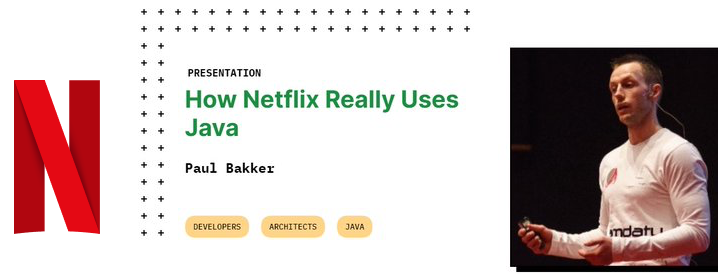
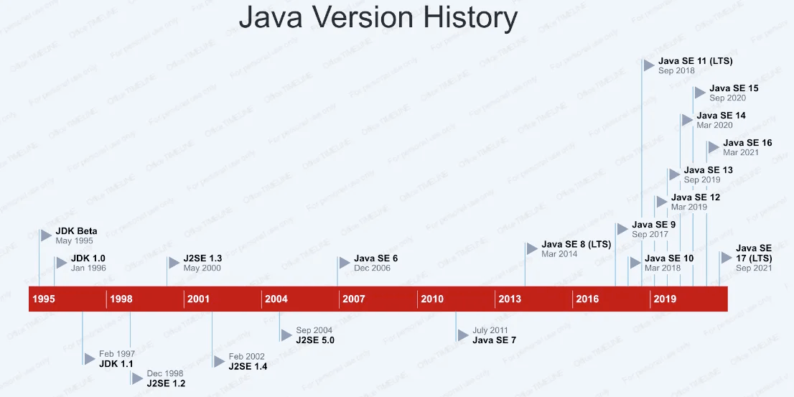
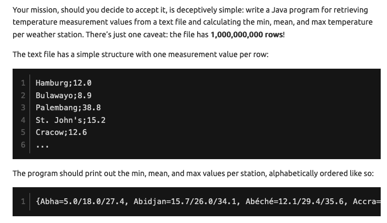
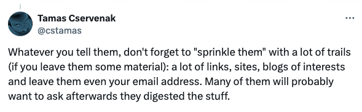

//usr/bin/env command -v jbang >/dev/null 2>&1 || curl -Ls https://sh.jbang.dev | bash -s app setup && exec `$SHELL -c "which jbang"` adoc2reveal.java "$0" "$@" ; exit $?
[.blackback]
= 30 år!
:date: 2024-03-05
:revealjs_theme: black
:customcss: css/custom.css
:favicon: ./images/favicon.ico
// better 
:title-slide-background-image: images/blackspace.png
:slide-background-image: images/slide2-white.png
:revealjs_fragmentInURL: true
:revealjs_hash: true
:revealjs_controls: true
:revealjs_controlsLayout: edges
:revealjs_controlsTutorial: true
:revealjs_slideNumber: c/t
:revealjs_showSlideNumber: speaker
:revealjs_autoPlayMedia: true
:revealjs_totalTime: 2700
//:revealjs_parallaxBackgroundImage:  images/mntbackground.jpg
//:revealjs_parallaxBackgroundSize: 4936px 2092px
:source-highlighter: highlight.js
// leave empty or pick style from gallery at https://highlightjs.org/static/demo/ and find url at https://cdnjs.com/libraries/highlight.js
:highlightjs-theme: https://cdnjs.cloudflare.com/ajax/libs/highlight.js/11.5.1/styles/base16/solarized-dark.min.css
:revealjs_preloadIframes: true
:icons: font

Erhvervsakademi Midtvest, Herning +
@maxandersen +
2024-03-05

image:images/icons/redhat.png[role=icon]

[.notes]
--
* Velkommen og kort introduktion
* Oversigt over Java's rolle
* "MythBusters" tema introduktion
--

== Spørgsmål: 

[%step]
Kender du til Java?
[%step]
Bruger du Java?
[%step]
Er Java dødt?

include::docs/myths.adoc[]

== Mit Job

Distinguished Engineer, Red Hat +
Co-lead for Quarkus

[transition=fade]
=== Mit Job

Diplomatic [.line-through]#Distinguished# Engineer +
Co-lead for Quarkus

=== Hvordan endte jeg her?

* '94-'96 - Datamatiker i Ikast
* '98-'00 - Datalog i Aalborg
* '00-'04 - Softwareudvikler i Aarhus
* '04-'17 - Open Source Udvikler i Neuchatel, Schweiz 
* '21-'24 - Open Source Udvikler i Pederstrup, Fyn

[%notitle]
=== Tilpasningsdygtig Dinosaur

[%notitle]
=== Mig 2

Bidraget til:: Hibernate, JBoss AS/WildFly, JBoss Tools, Eclipse, Ceylon, OpenShift, Quarkus, ...

Arbejdet tæt sammen med:: OpenJDK, GraalVM, Apache Camel, vert.x, KeyCloak, Microsoft VSCode, JetBrains, Docker, ...

Sideprojekter:: JBang, Home Assistant, ...

Top Programmeringssprog:: Java, Python 

include::docs/myths.adoc[]

== Myte #1: Ingen bruger Java!

[.notes]
--
* Udsagn: "Java er dødt"
* Virkeligheden: Statistikker og tendenser
* Interaktiv Afstemning: Publikums synspunkt
--

[%notitle]
=== Netflix 

"Every backend at ??? is basically a Java app....2800 Java applications...microservices of a variety of sizes....1500 internal libraries" - February ????

[%notitle]
=== Netflix afsløring

"Every backend at Netflix is basically a Java app....2800 Java applications...microservices of a variety of sizes....1500 internal libraries" - February 2024

https://www.infoq.com/presentations/netflix-java/

=== De Store ?

[%step]
Microsoft, Amazon, Google, Twitter, LinkedIn, NASDAQ ..

=== Hvad med Startups ? 

[%step]
Spotify, Slack, Lyft, DoorDash, Instagram, BitPanda, Uber, Airbnb, ...

=== Danmark ?

[%step]
Danske Bank, Maersk, Systematic, Netcompany, Trifork, LEGO, Bang & Olufsen, KMD, DSB, Rejseplanen, BankData, JYSK, TDC, Yousee,
3, Maersk, Grundfoss, Orested, Danfoss,Norlys,Skat og andre ministerier, Region Midt/Hoved, Schneider electric, ...

=== Hvad med Python? C#? Go? Rust? JavaScript?

* Java er brugt a https://www.statista.com/statistics/793628/worldwide-developer-survey-most-used-languages/[30% af alle udviklere]
* Java er #2 efter Python i https://pypl.github.io/PYPL.html[PYPL] og #4 efter Python/C/C++ i https://www.tiobe.com/tiobe-index/[TIOBE]
* https://blogs.oracle.com/java/post/java-recognized-as-the-favorite-programming-language[69% af fuldtids udviklere] globalt
* https://stratoflow.com/why-is-java-so-popular/["Java’s market share was over 31% in 2008 and has decreased to 15.81% in 2023']

=== Myte #1: Ingen bruger Java!

Conclusion?

[%step]

== Myte #2: Java er Omstændeligt

[.notes]
--
* Udsagn: "Java er Omstændeligt"
* Java's udvikling: Kode sammenligning
* Workshop Segment: Refaktor Java kode
--

[transition=fade]
=== Java Hello World

[source,java]
----
public class HelloWorld {
  public static void main(String[] args) {
    System.out.println("Hello, World");
  }
}
----

[transition=fade]
=== Java 21 Hello World

[source,java]
----
void main() {
  System.out.println("Hello, World");
}
----

[transition=fade]
=== Java 22 Hello World

[source,java]
----
void main() {
  println("Hello, World");
}
----

=== Java Release Cadence

include::docs/java5.adoc[]

[transition=fade]
=== Java 7: try-with-resources

[.stretch]
[source,java]
----
import java.io.BufferedReader;
import java.io.FileReader;
import java.io.IOException;
import static java.lang.System.out;

public class ReadFile {
    public static void main(String[] args) {
        try (BufferedReader reader = new BufferedReader(
                new FileReader("example.txt"))) {
            String line;
            while ((line = reader.readLine()) != null) {
                out.println(line);
            }
        } catch (IOException e) {
            e.printStackTrace();
        }
    }
}
----

[transition=fade]
=== Java 8: Streams & Lambdas

[source,java]
----
import java.io.IOException;
import static java.nio.file.Files.lines;
import java.nio.file.Paths;
import java.util.stream.Stream;
import static java.lang.System.out;

public class ReadFile {
    public static void main(String[] args) {
        try (Stream<String> stream = lines(Paths.get("example.txt"))) {
            stream.forEach(out::println);
        } catch (IOException e) {
            e.printStackTrace();
        }
    }
}
----

[transition=fade]
=== Java 10: var

[source,java]
----
import java.io.IOException;
import static java.nio.file.Files.lines;
import java.nio.file.Paths;
import java.util.stream.Stream;
import static java.lang.System.out;

public class ReadFile {
    public static void main(String[] args) {
        try (var stream = lines(Paths.get("example.txt"))) {
            stream.forEach(out::println);
        } catch (IOException e) {
            e.printStackTrace();
        }
    }
}
----

[transition=fade]
=== Java 11: readString

[source,java]
----
import java.io.IOException;
import java.nio.file.Files;
import java.nio.file.Path;
import static java.nio.file.Files.readString;
import static java.lang.System.out;

public class ReadFile {
    public static void main(String[] args) {
        try {
            var content = readString(Path.of("example.txt"));
            out.println(content);
        } catch (IOException e) {
            e.printStackTrace();
        }
    }
}
----

[transition=fade]
=== Java 21: unnamed class

[source,java]
----
import java.io.IOException;
import static java.nio.file.Path.of;
import static java.nio.file.Files.readString;
import static java.lang.System.out;

void main(String[] args) {
    try {
        out.println(readString(of("example.txt")));
    } catch (IOException e) {
        e.printStackTrace();
    }
}
----

[transition=fade]
=== Java 22?: default imports

[source,java]
----
import static java.nio.file.Path.of;
import static java.nio.file.Files.readString;

void main(String[] args) {
    try {
        println(readString(of("example.txt")));
    } catch (IOException e) {
        e.printStackTrace();
    }
}
----

include::docs/java5.adoc[]

=== Notable others

=== Java: Strenge

[source,java]
----
String navn = "John";
int alder = 55;
String indhold = "Hej " + navn + ",\n\n" +
                "Du er " + alder + " år gammel.\n\n" +
                "De bedste hilsner,\n" +
                "Max";
----

[transition=fade]
=== Java 17 & 21: Text Blocks & Templates

[source,java]
----
String navn = "John";
int alder = 55;
String indhold = STR."""
                Hej \{navn},
                
                Du er \{alder} år gammel.
                
                De bedste hilsner,
                Max
                """;
----

[transition=fade]
=== Data Classes

[.stretch]
[source,java,linenums]
----
class Employee {
 
    private String firstName;
    private String lastName;
    private int Id;
 
    public Employee(String firstName, String lastName,
                    int Id)
    {
 
        this.firstName = firstName;
        this.lastName = lastName;
        this.Id = Id;
    }
 
    public void setFirstName(String firstName)
    {
        this.firstName = firstName;
    }
 
    public String getFirstName() { return firstName; }
 
    public void setLastName(String lasstName)
    {
 
        this.lastName = lastName;
    }
 
    public String getLastName() { return lastName; }
 
    public void setId(int Id) { this.Id = Id; }
 
    public int getId() { return Id; }
 
    public String toString()
    {
 
        return "Employee [firstName=" + firstName
            + ", lastName=" + lastName + ", Id=" + Id + "]";
    }
 
    @Override public int hashCode()
    {
 
        final int prime = 31;
        int result = 1;
 
        result = prime * result + Id;
        result = prime * result
                 + ((firstName == null)
                        ? 0
                        : firstName.hashCode());
        result
            = prime * result
              + ((lastName == null) ? 0
                                    : lastName.hashCode());
 
        return result;
    }
 
    @Override public boolean equals(Object obj)
    {
 
        if (this == obj)
            return true;
 
        if (obj == null)
            return false;
 
        if (getClass() != obj.getClass())
            return false;
 
        Employee other = (Employee)obj;
 
        if (Id != other.Id)
            return false;
 
        if (firstName == null) {
            if (other.firstName != null)
                return false;
        }
 
        else if (!firstName.equals(other.firstName))
            return false;
 
        if (lastName == null) {
            if (other.lastName != null)
                return false;
        }
 
        else if (!lastName.equals(other.lastName))
            return false;
 
        return true;
    }
}
----

=== Java 14: Records

[source,java,linenums]
----
public record Employee(int id, 
                       String firstName, 
                       String lastName) {}
----

=== Hvad er der sket?

* 30 års "bagage" som verdens mest populære sprog
* Skoler/Universiteter opdaterer ikke hvad der virker

=== Myte #2: Java er Omstændeligt?

Conclusion?

[%step]

== Myte #3: Java er Svært at Bruge

=== Dagens enterprise Java

Maven, Gradle...

include::docs/gettingstarted.adoc[]

include::docs/editing.adoc[]

include::docs/debugging.adoc[]

include::docs/summary.adoc[]

include::docs/beyondgettingstarted.adoc[]

include::docs/theend.adoc[]

=== JBang *is* Java

=== Myte #3: Java er Svært at Bruge?

Conclusion?

[%step]

[.notes]
--
* Udsagn: "Java er Svært at Bruge"
* Forenkling af Java: Introduktion til JBang
* Prøv og Fejl Session: JBang script
--

== Myth #4: Java er Langsomt

[.notes]
--
* Udsagn: "Java er Langsomt"
* Java Ydeevne I Dag: Quarkus og GraalVM
* Demo: Starte et projekt med Quarkus
--

=== 1️⃣🐝🏎️ 

[%step]
The https://www.morling.dev/blog/one-billion-row-challenge/[One Billion Row] Challenge

[%step]

=== 1️⃣🐝🏎️ Results

[%step]
Baseline: 4m 49s

[%step]
Result: 1.5s

[%step]
192x faster 

=== Hvordan? 

[%step]
* Minimer IO
* Divde & Conquer
* Udnyt CPU arkitektur
* Optimeret hukommelse (unsafe())
* GraalVM native binary

=== Tidens trend

* Build Time vs Run Time
* Quarkus, Micronaut, Helidon, Spring Boot, ...

=== 
== Pause

[.notes]
--
* En kort pause
--

== Hands-on Workshop

* Installer JBang (https://jbang.dev/download)
* 
[.notes]
--
* Workshop mål
* Gruppeaktivitet: Simpelt projekt/udfordring
* Eksperimentering og udforskning
--

== Q&A og Afslutning
[.notes]
--
* Open floor for questions
* Key takeaways summary
* Further learning resources
--

== Links

* https://jbang.dev/download
* https://quarkus.io/guides
* https://

