//usr/bin/env command -v jbang >/dev/null 2>&1 || curl -Ls https://sh.jbang.dev | bash -s app setup && exec `$SHELL -c "which jbang"` adoc2reveal.java "$0" "$@" ; exit $?
[.blackback]
= Embracing Quarkus 3
:date: 2023-06-05
:revealjs_theme: white
:customcss: css/custom.css
:favicon: ./images/favicon.ico
// better 
:title-slide-background-image: images/blackspace.png
:slide-background-image: images/slide2-white.png
:revealjs_fragmentInURL: true
:revealjs_hash: true
:revealjs_controls: true
:revealjs_controlsLayout: edges
:revealjs_controlsTutorial: true
:revealjs_slideNumber: c/t
:revealjs_showSlideNumber: speaker
:revealjs_autoPlayMedia: true
:revealjs_totalTime: 2700
//:revealjs_parallaxBackgroundImage:  images/mntbackground.jpg
//:revealjs_parallaxBackgroundSize: 4936px 2092px
:source-highlighter: highlight.js
// leave empty or pick style from gallery at https://highlightjs.org/static/demo/ and find url at https://cdnjs.com/libraries/highlight.js
:highlightjs-theme: https://cdnjs.cloudflare.com/ajax/libs/highlight.js/11.5.1/styles/base16/solarized-dark.min.css
:revealjs_preloadIframes: true
:icons: font

The Future is now +
Max Rydahl Andersen +
@maxandersen +


[%notitle]
== Quarkus All The Things

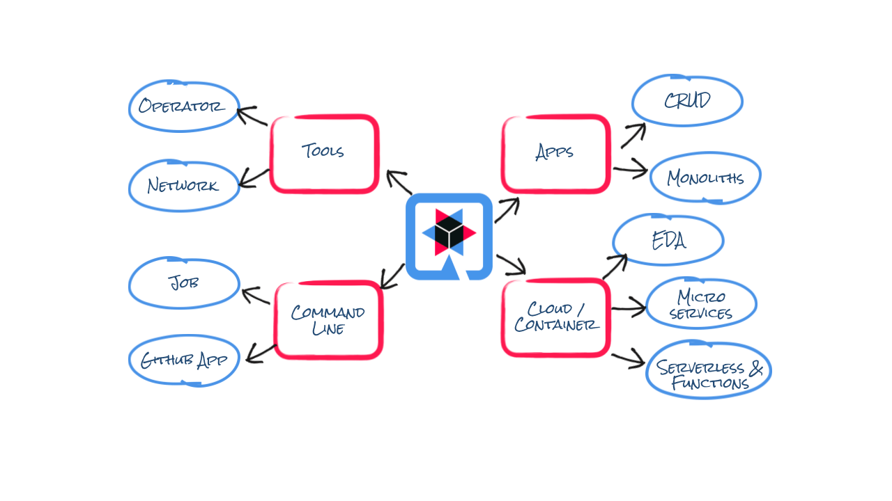

[%notitle]
== Supersonic

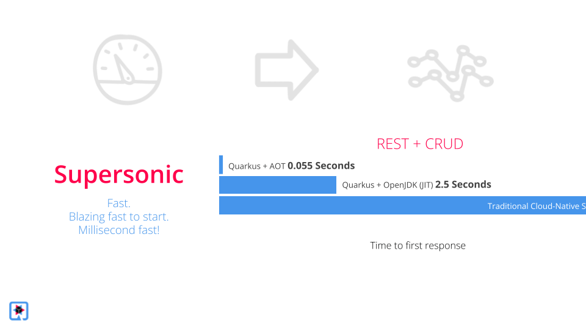

[%notitle]
== Subatomic

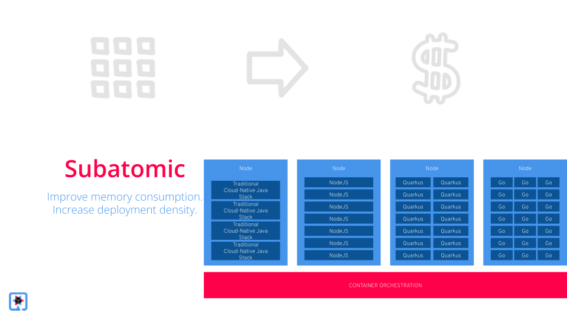

[%notitle]
== Hot Java 

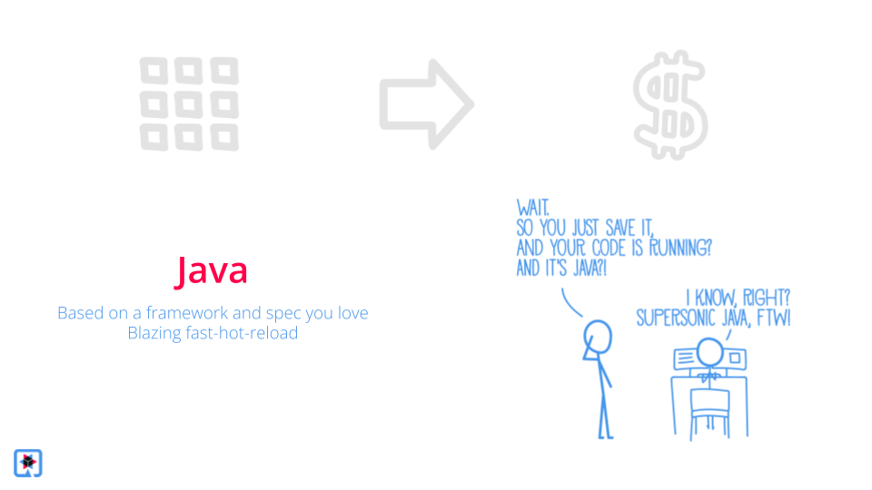

[%notitle]
== Nice Cake!

image::images/nice-cake-strawberry.avif[background, size=cover]

[.notes]
--
That is a proper cake!

Excellent performance,
Ability to have super density
- all somethig that make your devops team
happy and especially the financial department
and even better yet - your users can wait less if done right!

And then the toppings are the awesome developer experience.
--

[transition=fade]
== {classic}
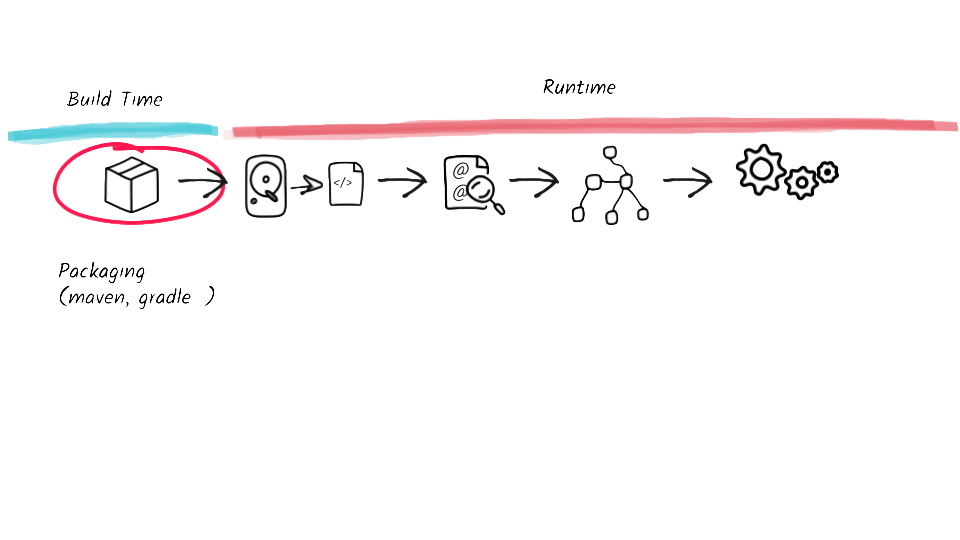

[transition=none]
== {classic}

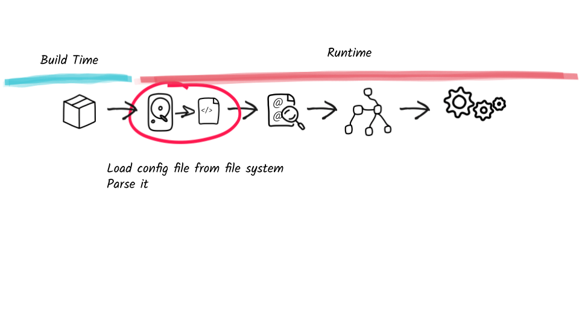

[transition=none]
== {classic}

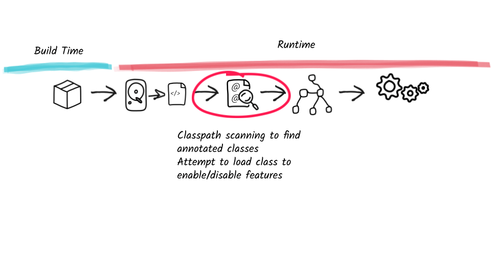

[transition=none]
== {classic}

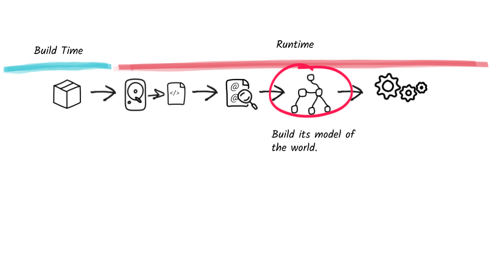

[transition=none]
== {classic}

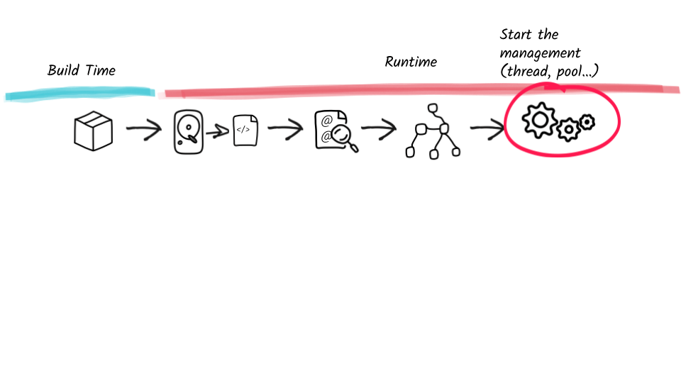

[transition=none]
== The Quarkus Way

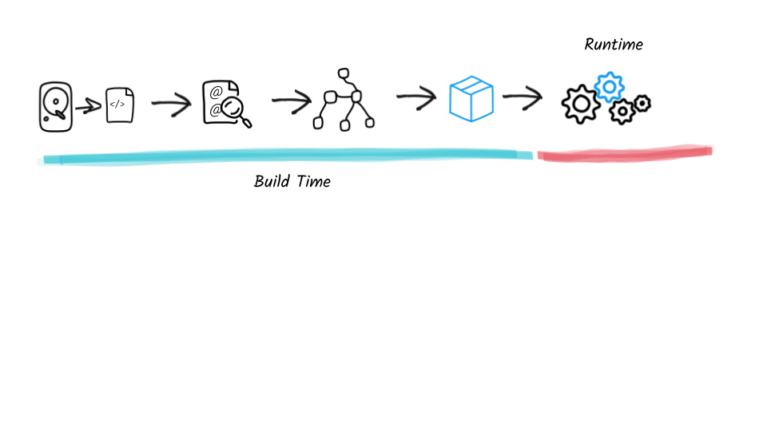

[%notitle]
== Quarkus 3

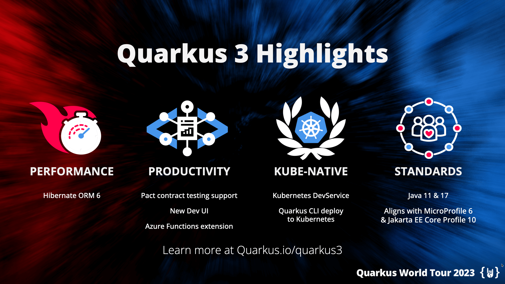

== Updating to Quarkus 3

[%step]
* `javax.*` packages are now in `jakarta.*`
* reactive streams Flow to Java 9+ Flow API
* Hibernate 5 to 6
* ...

== Updating to Quarkus 3

* icon:heart[] `quarkus update --stream=3.0`
* Powered by OpenRewrite (and Windup)


[.notes]
--
```bash
git clone https://github.com/quarkusio/todo-demo-app
quarkus dev
quarkus update --stream=3.0
hibernate_seq -> todo_seq
```
--

== Why Update

== Conclusion

[%step]
- Quarkus is supersonic and subatomic Java
- Developers get to have joy
- Operations gets resources
- Updates are doable
- Customers get what they need faster
- Because we broke some eggs!
- Try https://quarkus.io[quarkus.io]


