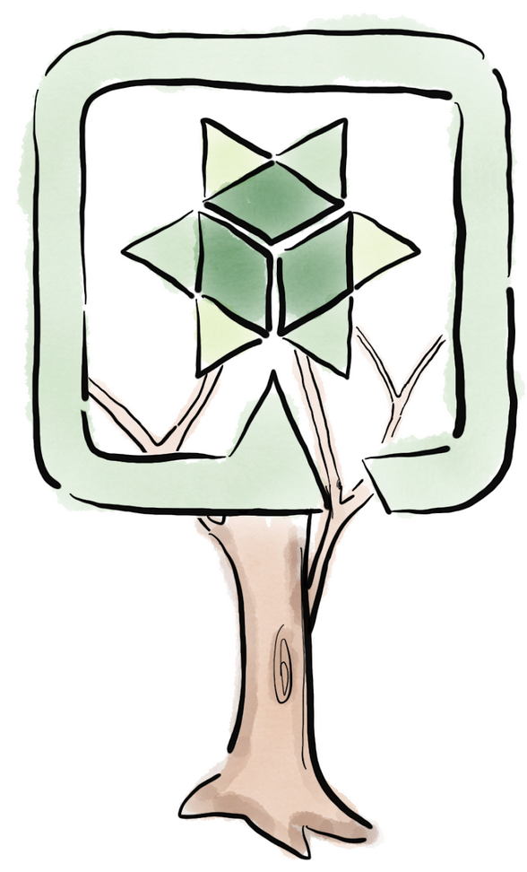
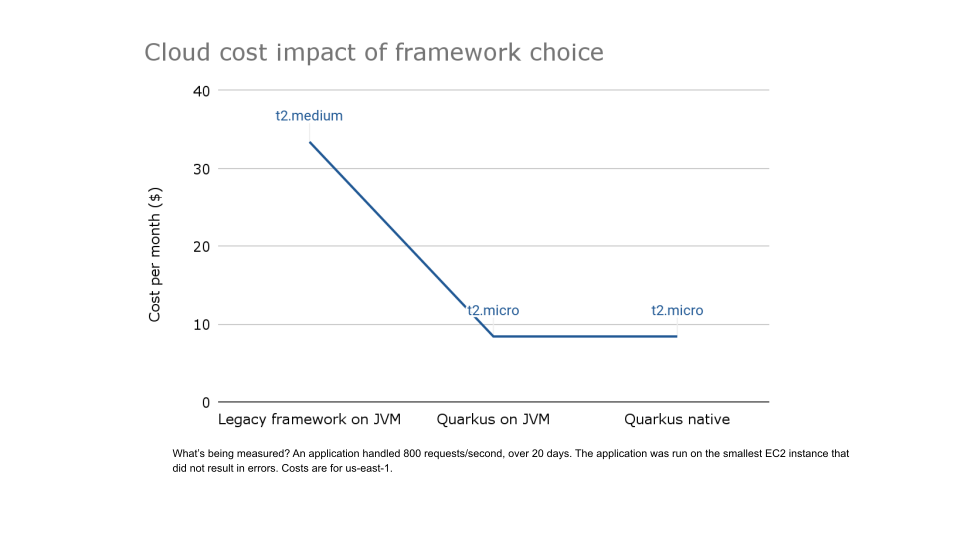
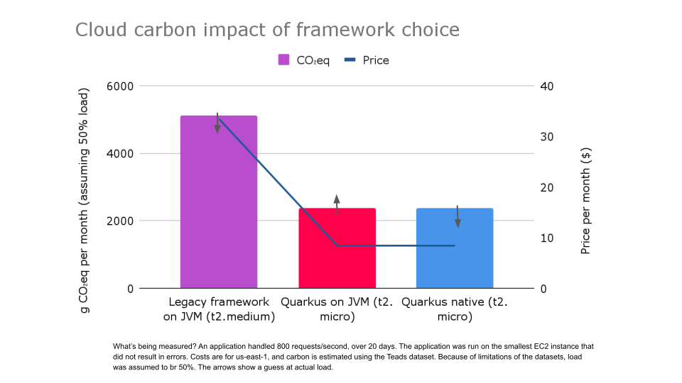
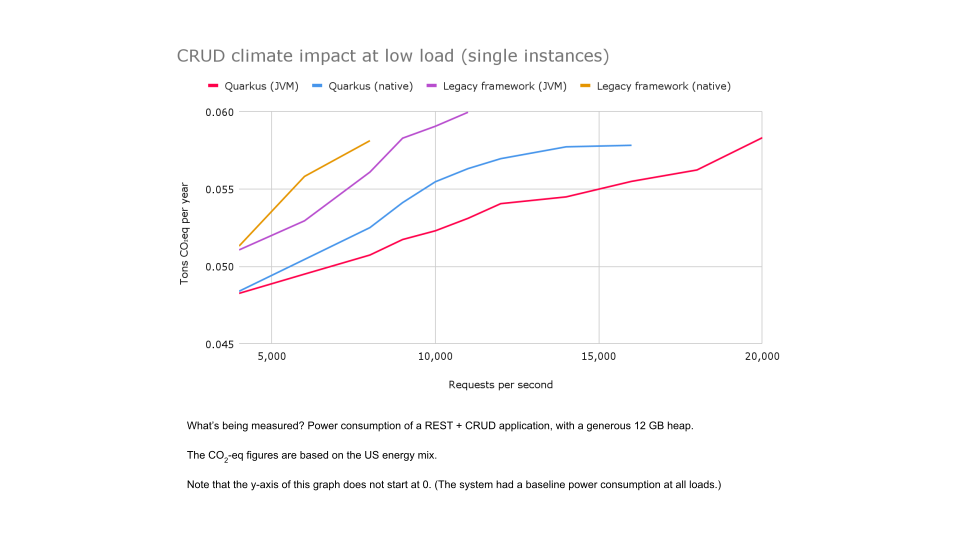
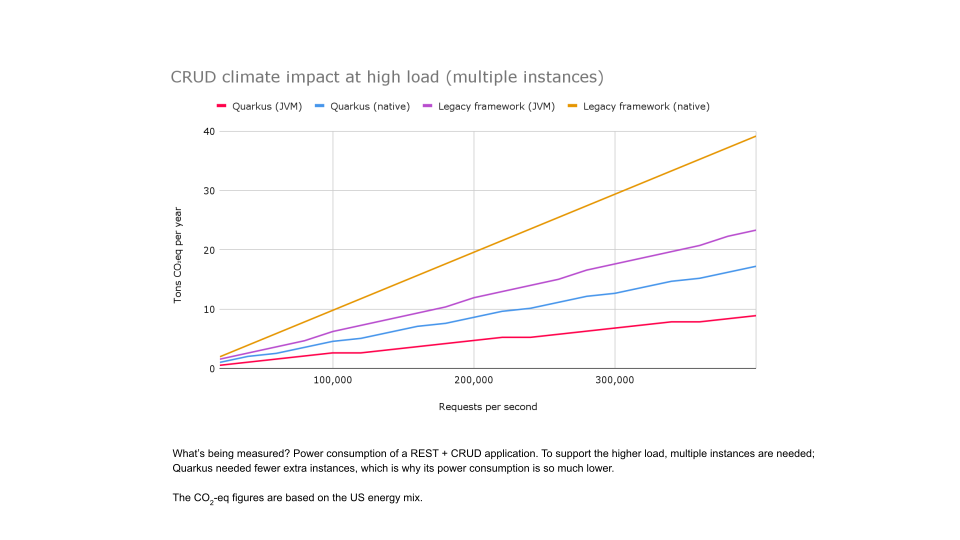

//usr/bin/env command -v jbang >/dev/null 2>&1 || curl -Ls https://sh.jbang.dev | bash -s app setup && exec `$SHELL -c "which jbang"` adoc2reveal.java "$0" "$@" ; exit $?
[.blackback]
= Java is dead!?
:date: 2024-03-05
:revealjs_theme: black
:customcss: css/custom.css
:favicon: ./images/favicon.ico
// better 
:title-slide-background-image: images/blackspace.png
:slide-background-image: images/slide2-white.png
:revealjs_fragmentInURL: true
:revealjs_hash: true
:revealjs_controls: true
:revealjs_controlsLayout: edges
:revealjs_controlsTutorial: true
:revealjs_slideNumber: c/t
:revealjs_showSlideNumber: speaker
:revealjs_autoPlayMedia: true
:revealjs_totalTime: 2700
//:revealjs_parallaxBackgroundImage:  images/mntbackground.jpg
//:revealjs_parallaxBackgroundSize: 4936px 2092px
:source-highlighter: highlight.js
// leave empty or pick style from gallery at https://highlightjs.org/static/demo/ and find url at https://cdnjs.com/libraries/highlight.js
:highlightjs-theme: https://cdnjs.cloudflare.com/ajax/libs/highlight.js/11.5.1/styles/base16/solarized-dark.min.css
:revealjs_preloadIframes: true
:icons: font

EAMV, Herning +
@maxandersen +
2024-03-05

image:images/icons/redhat.png[role=icon]

[.notes]
--
* Welcome and brief introduction
* Overview of Java's role
* "MythBusters" theme introduction
--

== Agenda
* Overview of today's session
* List of myths to be debunked
* Workshop and Q&A segments

== Me

* '92-'96 - Informatik Ass. og Datamatiker i Ikast
* '98-'00 - Datalog i Aalborg
* '00-'04 - Softwareudvikler i Aarhus
* '04-'17 - Open Source Udvikler i Neuchatel, Schweiz 
* '21-'24 - Open Source Udvikler i Pederstrup, Fyn

[%notitle]
=== Adaptable Dinosaur
image::images/adaptabledinosaur.webp[]

[%notitle]
=== Me 2

Contributed to:: Hibernate, JBoss AS/WildFly, JBoss Tools, Eclipse, Ceylon, OpenShift, Quarkus, ...

Worked closely with:: OpenJDK, GraalVM, Apache Camel, vert.x, KeyCloak, JetBrains, Docker, ...

Side Project:: JBang, HomeAssistant

Top Programming Languages:: Java, Python 

=== My Main Job

Distinguished Engineer

[transition=fade]
==== My Main Job
Diplomatic [.line-through]#Distinguished# Engineer

== Questions: 

[%step]
Do you know Java?
[%step]
Do you use Java?
[%step]
Is Java dead ?

[%notitle]
== Mythbusting!
image::images/mythbusting.webp[background]


== Myth #1: Noone is using Java!

[.notes]
--
* Statement: "Java is Dead"
* The reality: Statistics and trends
* Interactive Poll: Audience's view
--

[%notitle]
=== Netflix 

"Every backend at ??? is basically a Java app....2800 Java applications...microservices of a variety of sizes....1500 internal libraries" - February ????

[%notitle]
=== Netflix reveal

"Every backend at Netflix is basically a Java app....2800 Java applications...microservices of a variety of sizes....1500 internal libraries" - February 2024

image::images/netflixjava.png[]

https://www.infoq.com/presentations/netflix-java/

=== The Big Ones ?

Microsoft, Amazon, Google, Twitter, LinkedIn, ..

=== What about Startups ? 

Spotify, Slack, Lyft, DoorDash, Instagram, BitPanda,  Uber, Airbnb, ...

=== Denmark

Danske Bank, Maersk, Systematic, Netcompany, Trifork, LEGO, Bang & Olufsen, KMD, DSB, Rejseplanen, BankData, JYSK, ...

=== Language Evolution


== Myth #2: Java is Verbose

[.notes]
--
* Statement: "Java is Verbose"
* Java's evolution: Code comparison
* Workshop Segment: Refactor Java code
--

[transition=fade]
=== Java Hello World

[source,java]
----
public class HelloWorld {
  public static void main(String[] args) {
    System.out.println("Hello, World");
  }
}
----

[transition=fade]
=== Java 21 Hello World

[source,java]
----
void main() {
  System.out.println("Hello, World");
}
----

[transition=fade]
=== Java 22 Hello World

[source,java]
----
void main() {
  println("Hello, World");
}
----

=== Pre-Java 5: File I/O

[source,java]
----
import java.io.BufferedReader;
import java.io.FileReader;
import java.io.IOException;

public class ReadFileJava6 {
    public static void main(String[] args) {
        BufferedReader reader = null;
        try {
            reader = new BufferedReader(new FileReader("example.txt"));
            String line;
            while ((line = reader.readLine()) != null) {
                System.out.println(line);
            }
        } catch (IOException e) {
            e.printStackTrace();
        } finally {
            if (reader != null) {
                try {
                    reader.close();
                } catch (IOException e) {
                    e.printStackTrace();
                }
            }
        }
    }
}
----

=== Java 5: static import

[source,java]
----
import java.io.BufferedReader;
import java.io.FileReader;
import java.io.IOException;
import static java.lang.System.out;

public class ReadFileJava6 {
    public static void main(String[] args) {
        BufferedReader reader = null;
        try {
            reader = new BufferedReader(new FileReader("example.txt"));
            String line;
            while ((line = reader.readLine()) != null) {
                out.println(line);
            }
        } catch (IOException e) {
            e.printStackTrace();
        } finally {
            if (reader != null) {
                try {
                    reader.close();
                } catch (IOException e) {
                    e.printStackTrace();
                }
            }
        }
    }
}
----

[transition=fade]
=== Java 7: try-with-resources

[source,java]
----
import java.io.BufferedReader;
import java.io.FileReader;
import java.io.IOException;
import static java.lang.System.out;

public class ReadFileJava7 {
    public static void main(String[] args) {
        try (BufferedReader reader = new BufferedReader(new FileReader("example.txt"))) {
            String line;
            while ((line = reader.readLine()) != null) {
                out.println(line);
            }
        } catch (IOException e) {
            e.printStackTrace();
        }
    }
}
----

[transition=fade]
=== Java 8: Streams & Lambdas

[source,java]
----
import java.io.IOException;
import static java.nio.file.Files.lines;
import java.nio.file.Paths;
import java.util.stream.Stream;
import static java.lang.System.out;

public class ReadFileJava8 {
    public static void main(String[] args) {
        try (Stream<String> stream = lines(Paths.get("example.txt"))) {
            stream.forEach(out::println);
        } catch (IOException e) {
            e.printStackTrace();
        }
    }
}
----

[transition=fade]
=== Java 10: var

[source,java]
----
import java.io.IOException;
import static java.nio.file.Files.lines;
import java.nio.file.Paths;
import java.util.stream.Stream;
import static java.lang.System.out;

public class ReadFileJava8 {
    public static void main(String[] args) {
        try (var stream = lines(Paths.get("example.txt"))) {
            stream.forEach(out::println);
        } catch (IOException e) {
            e.printStackTrace();
        }
    }
}
----

=== Java 11: readString

[source,java]
----
import java.io.IOException;
import java.nio.file.Files;
import java.nio.file.Path;
import static java.nio.file.Files.readString;
import static java.lang.System.out;

public class ReadFileJava11 {
    public static void main(String[] args) {
        try {
            var content = readString(Path.of("example.txt"));
            out.println(content);
        } catch (IOException e) {
            e.printStackTrace();
        }
    }
}
----

=== Java 21: unnamed class

[source,java]
----
import java.io.IOException;
import static java.nio.file.Path.of;
import static java.nio.file.Files.readString;
import static java.lang.System.out;

void main(String[] args) {
    try {
        out.println(readString(of("example.txt")));
    } catch (IOException e) {
        e.printStackTrace();
    }
}
----

=== Notable others

=== Java: Strings

[source,java]
----
String name = "John";
int age = 55;
String content = "Hi " + name + ",\n\n" +
                "You are " + age + " years old.\n\n" +
                "Best regards,\n" +
                "Max";
----

[transition=fade]
=== Java 17 & 21: Text Blocks & Templates

[source,java]
----
String name = "John";
int age = 55;
String content = STR."""
                Hi \{name},
                
                You are \{age} years old.
                
                Best regards,
                Max
                """;
----

[transition=fade]
=== Data Classes

[source,java,linenums]
----
class Employee {
 
    private String firstName;
    private String lastName;
    private int Id;
 
    public Employee(String firstName, String lastName,
                    int Id)
    {
 
        this.firstName = firstName;
        this.lastName = lastName;
        this.Id = Id;
    }
 
    public void setFirstName(String firstName)
    {
        this.firstName = firstName;
    }
 
    public String getFirstName() { return firstName; }
 
    public void setLastName(String lasstName)
    {
 
        this.lastName = lastName;
    }
 
    public String getLastName() { return lastName; }
 
    public void setId(int Id) { this.Id = Id; }
 
    public int getId() { return Id; }
 
    public String toString()
    {
 
        return "Employee [firstName=" + firstName
            + ", lastName=" + lastName + ", Id=" + Id + "]";
    }
 
    @Override public int hashCode()
    {
 
        final int prime = 31;
        int result = 1;
 
        result = prime * result + Id;
        result = prime * result
                 + ((firstName == null)
                        ? 0
                        : firstName.hashCode());
        result
            = prime * result
              + ((lastName == null) ? 0
                                    : lastName.hashCode());
 
        return result;
    }
 
    @Override public boolean equals(Object obj)
    {
 
        if (this == obj)
            return true;
 
        if (obj == null)
            return false;
 
        if (getClass() != obj.getClass())
            return false;
 
        Employee other = (Employee)obj;
 
        if (Id != other.Id)
            return false;
 
        if (firstName == null) {
            if (other.firstName != null)
                return false;
        }
 
        else if (!firstName.equals(other.firstName))
            return false;
 
        if (lastName == null) {
            if (other.lastName != null)
                return false;
        }
 
        else if (!lastName.equals(other.lastName))
            return false;
 
        return true;
    }
}
----

=== Java 14: Records

[source,java]
----
public record Employee(int id, String firstName, String lastName) {}
----

=== Conclusions

Is Java still verbose?

== Myth #3: Java is Hard to Use

=== Todays enterprise Java

Maven, Gradle...

include::docs/gettingstarted.adoc[]

include::docs/editing.adoc[]

include::docs/debugging.adoc[]

include::docs/summary.adoc[]

include::docs/beyondgettingstarted.adoc[]

include::docs/theend.adoc[]

[.notes]
--
* Statement: "Java is Hard to Use"
* Simplifying Java: Introduction to JBang
* Trial and Error Session: JBang script
--

== Myth #4: Java is Slow

[.notes]
--
* Statement: "Java is Slow"
* Java Performance Today: Quarkus and GraalVM
* Demo: Starting a project with Quarkus
--

== Break

[.notes]
--
* A short break
--

== Hands-on Workshop

[.notes]
--
* Workshop objectives
* Group activity: Simple project/challenge
* Experimentation and exploration
--

== Q&A and Wrap-Up
[.notes]
--
* Open floor for questions
* Key takeaways summary
* Further learning resources
--

== Links
image::images/sprinklethem.png[]

* https://jbang.dev/download
* https://quarkus.io/guides
* https://


[%notitle,background-iframe="https://quarkus.io/blog/road-to-quarkus-3/"]
== Starting Quarkus 3

[%notitle]
== Supersonic

image::images/supersonic.png[background, size=cover]

[%notitle]
=== Subatomic

image::images/subatomic.png[background, size=cover]

[%notitle]
=== Hot Java 
:classic: The classic way

image::images/hotjava.png[background]

[.notes]
--
That is a proper cake!

Excellent performance,
Ability to have super density
- all somethig that make your devops team
happy and especially the financial department
and even better yet - your users can wait less if done right!

And then the toppings are the awesome developer experience.
--

[transition=fade]
=== {classic}
image::images/buildruntime-1.png[]

[transition=none]
=== {classic}

image::images/buildruntime-2.png[]

[transition=none]
=== {classic}

image::images/buildruntime-3.png[]

[transition=none]
=== {classic}

image::images/buildruntime-4.png[]

[transition=none]
=== {classic}

image::images/buildruntime-5.png[]

[transition=none]
=== The Quarkus Way

image::images/buildruntime-6.png[]

== Demo Time


[%notitle,background-iframe="https://quarkus.io/blog/road-to-quarkus-3/"]
== Back to starting Quarkus 3

== Why Quarkus 3

[%step]
A foundation to do more!

[%notitle]
=== Quarkus 3

image::images/quarkus3highlights.png[background, size=cover]

=== Updating to Quarkus 3

[%step]
* `javax.*` packages are now in `jakarta.*`
* reactive streams Flow to Java 9+ Flow API
* Hibernate 5 to 6
* ... and more

[.notes]

=== Updating to Quarkus 3

* icon:heart[] `quarkus update --stream=3.0`
* Powered by OpenRewrite (and Windup)

[.notes]
--
```bash
git clone https://github.com/quarkusio/todo-demo-app
quarkus dev
quarkus update --stream=3.0
hibernate_seq -> todo_seq
```
--

=== Why Update

[.blackback]
=== Jakarta EE 10


[%step]
* Lawyer Driven Development
* javax.* -> jakarta.*
* Everybody is finally doing it!

[transition=fade]
[.blackback]
=== Hibernate 6


[transition=fade]
=== Hibernate 6

* Rewrites of internals to enable faster innovation

[%step]
* Lots of optimizations from Quarkus learnings
* Removal of Deprecations
* Hibernate Reactive 2
* Tune in for https://www.youtube.com/watch?v=nXnxcl4v9eg&list=PLsM3ZE5tGAVatO65JIxgskQh-OKoqM4F2[Quarkus Insights #131]

=== New Dev UI

[%notitle]
=== Dev UI

image::https://quarkus.io/assets/images/posts/3.0.0.final/dev-ui.gif[background]

[.notes]

=== Quarkus CLI Plugins

[%step]
* Plugins can be ...
    ** ...an executable (binary or script)
    ** ...a jbang alias/script reference
    ** ...a maven coordinates
* Plugins come from...
    ** ...`PATH`
    ** ...JBang Catalogs
    ** ...Quarkus Extensions

[.notes]

=== Management Port

[%step]
* Probably the most requested feature
* `quarkus.management.enabled=true`
* `http://<host>:9000/q/health|metrics|info|...`

[.notes]
=== /q/info

[source,json]
----
{
  "git" : {
    "branch" : "master",
    "commit" : {
      "id" : "0d52564219c29e47f5f5878e8fd8e0d04329288b",
      "time" : "2023-06-05T23:49:47+02:00"
    }
  },
  "java" : {
    "version" : "11.0.11"
  },
  "os" : {
    "name" : "Mac OS X",
    "version" : "11.3",
    "arch" : "x86_64"
  },
  "build" : {
    "group" : "io.quarkus.sample",
    "artifact" : "todo-backend",
    "version" : "1.0-SNAPSHOT",
    "time" : "2023-06-06T00:02:26.692472+02:00"
  }
}
----

[%notitle,background-iframe="http://localhost:8080/q/dev-ui/io.quarkus.quarkus-info/information"]
=== /q/info

=== Migrations as Jobs

Have a flyway or liquibase migration ?

[%step]
* Kubernetes Job auto-configured
* Ensure migrations are run before app starts

== Beyond 3.0

* ...or at least some of it

=== Long Term Support

[%step]
* How to release fast but still support ?
* Red Hat Build of Quarkus
    ** 1.11,2.7,2.13,3.2
* Quarkus 3.2+ will be community LTS

=== io_uring

* Drastic io performance improvements
* Requires recent Linux kernel (RHEL 9+)

=== Virtual Threads

[%step]
* `@RunOnVirtualThread` since 2.10 (May 2022)
* Balance between OpenJDK vs Java ecosystem benefits
* Stay tuned...

== Frontends 


[%step]
* Can we make them fun to develop ?
* Can we support them all ?

=== Quinoa

* Use npm based frontend with Quarkus
* Works with live-reload

=== WebAssets

* Use esbuild to bundle frontend assets

=== Qute Server Pages

* Direct serving of Qute from `resources` as pages
* `src/main/resource/templates/*` -> `qsp/*`

=== Renarde

* Quarkus Web Framework
* Serverside rendering using Qute

[%notitle]
=== Frontend Rainbow


* Quinoa
* Renarde
* Qute Server Pages 
* WebAssets


[%notitle]
== Quarkus All The Things

image::images/quarkusallthethings.png[background, size=cover]

== How Green is Quarkus?

]

[%notitle]
=== Green Quarkus



[%notitle]
=== Green Quarkus



[%notitle]
=== Green Quarkus



[%notitle]
=== Green Quarkus



[.columns]
=== Does Quarkus reduce carbon emissions?

[.column]


[%step]
[.column]
====
Quarkus saves +

* Time
* Money
* Carbon (~2x)

[%step]
Native? +
[%step]
It depends
====

== Is Quarkus Secure? 

[%step]
YES!^*^

[%notitle,background-iframe="https://quarkus.io/guides/security-architecture"]
=== Security Architecture

[%notitle,background-iframe="https://quarkus.io/guides/security-authentication"]

[%notitle,background-iframe="https://quarkus.io/guides/security-openid-connect-providers"]
=== OpenID Providers


== Conclusion

[%step]
- Quarkus is supersonic and subatomic Java
- Developers get to have joy
- Operations gets resources
- Quarkus 3 is easy to update to
- Quarkus is green
- Quarkus is secure
- Quarkus 3 is a foundation for more
- Try https://quarkus.io[quarkus.io]


