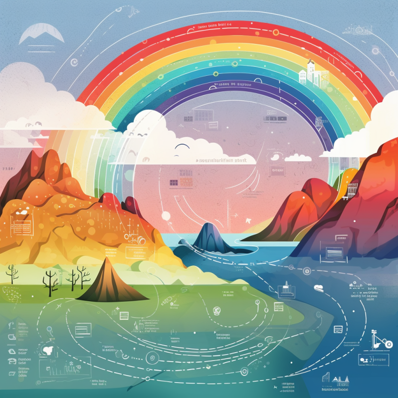

//usr/bin/env command -v jbang >/dev/null 2>&1 || curl -Ls https://sh.jbang.dev | bash -s app setup && exec `$SHELL -c "which jbang"` adoc2reveal.java "$0" "$@" ; exit $?
[.blackback]
= Embracing Quarkus 3
:date: 2023-10-10
:revealjs_theme: white
:customcss: css/custom.css
:favicon: ./images/favicon.ico
// better 
:title-slide-background-image: images/blackspace.png
:slide-background-image: images/slide2-white.png
:revealjs_fragmentInURL: true
:revealjs_hash: true
:revealjs_controls: true
:revealjs_controlsLayout: edges
:revealjs_controlsTutorial: true
:revealjs_slideNumber: c/t
:revealjs_showSlideNumber: speaker
:revealjs_autoPlayMedia: true
:revealjs_totalTime: 2700
//:revealjs_parallaxBackgroundImage:  images/mntbackground.jpg
//:revealjs_parallaxBackgroundSize: 4936px 2092px
:source-highlighter: highlight.js
// leave empty or pick style from gallery at https://highlightjs.org/static/demo/ and find url at https://cdnjs.com/libraries/highlight.js
:highlightjs-theme: https://cdnjs.cloudflare.com/ajax/libs/highlight.js/11.5.1/styles/base16/solarized-dark.min.css
:revealjs_preloadIframes: true
:icons: font

BankData, Aarhus +
@maxandersen +
2023-10-10

image:images/icons/redhat.png[role=icon]

[%notitle,background-iframe="https://quarkus.io/blog/road-to-quarkus-3/"]
== Starting Quarkus 3

[%notitle]
== Supersonic

image::images/supersonic.png[background, size=cover]

[%notitle]
=== Subatomic

image::images/subatomic.png[background, size=cover]

[%notitle]
=== Hot Java 
:classic: The classic way

image::images/hotjava.png[background]

[.notes]
--
That is a proper cake!

Excellent performance,
Ability to have super density
- all somethig that make your devops team
happy and especially the financial department
and even better yet - your users can wait less if done right!

And then the toppings are the awesome developer experience.
--

[transition=fade]
=== {classic}


[transition=none]
=== {classic}


[transition=none]
=== {classic}


[transition=none]
=== {classic}

image::images/buildruntime-4.png[]

[transition=none]
=== {classic}

image::images/buildruntime-5.png[]

[transition=none]
=== The Quarkus Way

image::images/buildruntime-6.png[]

== Demo Time


[%notitle,background-iframe="https://quarkus.io/blog/road-to-quarkus-3/"]
== Back to starting Quarkus 3

== Why Quarkus 3

[%step]
A foundation to do more!

[%notitle]
=== Quarkus 3


=== Updating to Quarkus 3

[%step]
* `javax.*` packages are now in `jakarta.*`
* reactive streams Flow to Java 9+ Flow API
* Hibernate 5 to 6
* ... and more

[.notes]

=== Updating to Quarkus 3

* icon:heart[] `quarkus update --stream=3.0`
* Powered by OpenRewrite (and Windup)

[.notes]
--
```bash
git clone https://github.com/quarkusio/todo-demo-app
quarkus dev
quarkus update --stream=3.0
hibernate_seq -> todo_seq
```
--

=== Why Update

[.blackback]
=== Jakarta EE 10

image::images/lawyerdrivendevelopment.png[background]

[%step]
* Lawyer Driven Development
* javax.* -> jakarta.*
* Everybody is finally doing it!

[transition=fade]
[.blackback]
=== Hibernate 6


[transition=fade]
=== Hibernate 6

* Rewrites of internals to enable faster innovation

[%step]
* Lots of optimizations from Quarkus learnings
* Removal of Deprecations
* Hibernate Reactive 2
* Tune in for https://www.youtube.com/watch?v=nXnxcl4v9eg&list=PLsM3ZE5tGAVatO65JIxgskQh-OKoqM4F2[Quarkus Insights #131]

=== New Dev UI

[%notitle]
=== Dev UI

image::https://quarkus.io/assets/images/posts/3.0.0.final/dev-ui.gif[background]

[.notes]

=== Quarkus CLI Plugins

[%step]
* Plugins can be ...
    ** ...an executable (binary or script)
    ** ...a jbang alias/script reference
    ** ...a maven coordinates
* Plugins come from...
    ** ...`PATH`
    ** ...JBang Catalogs
    ** ...Quarkus Extensions

[.notes]

=== Management Port

[%step]
* Probably the most requested feature
* `quarkus.management.enabled=true`
* `http://<host>:9000/q/health|metrics|info|...`

[.notes]
=== /q/info

[source,json]
----
{
  "git" : {
    "branch" : "master",
    "commit" : {
      "id" : "0d52564219c29e47f5f5878e8fd8e0d04329288b",
      "time" : "2023-06-05T23:49:47+02:00"
    }
  },
  "java" : {
    "version" : "11.0.11"
  },
  "os" : {
    "name" : "Mac OS X",
    "version" : "11.3",
    "arch" : "x86_64"
  },
  "build" : {
    "group" : "io.quarkus.sample",
    "artifact" : "todo-backend",
    "version" : "1.0-SNAPSHOT",
    "time" : "2023-06-06T00:02:26.692472+02:00"
  }
}
----

[%notitle,background-iframe="http://localhost:8080/q/dev-ui/io.quarkus.quarkus-info/information"]
=== /q/info

=== Migrations as Jobs

Have a flyway or liquibase migration ?

[%step]
* Kubernetes Job auto-configured
* Ensure migrations are run before app starts

== Beyond 3.0

* ...or at least some of it

=== Long Term Support

[%step]
* How to release fast but still support ?
* Red Hat Build of Quarkus
    ** 1.11,2.7,2.13,3.2
* Quarkus 3.2+ will be community LTS

=== io_uring

* Drastic io performance improvements
* Requires recent Linux kernel (RHEL 9+)

=== Virtual Threads

[%step]
* `@RunOnVirtualThread` since 2.10 (May 2022)
* Balance between OpenJDK vs Java ecosystem benefits
* Stay tuned...

== Frontends 



[%step]
* Can we make them fun to develop ?
* Can we support them all ?

=== Quinoa

* Use npm based frontend with Quarkus
* Works with live-reload

=== WebAssets

* Use esbuild to bundle frontend assets

=== Qute Server Pages

* Direct serving of Qute from `resources` as pages
* `src/main/resource/templates/*` -> `qsp/*`

=== Renarde

* Quarkus Web Framework
* Serverside rendering using Qute

[%notitle]
=== Frontend Rainbow


* Quinoa
* Renarde
* Qute Server Pages 
* WebAssets


[%notitle]
== Quarkus All The Things


== How Green is Quarkus?

]

[%notitle]
=== Green Quarkus


[%notitle]
=== Green Quarkus


[%notitle]
=== Green Quarkus


[%notitle]
=== Green Quarkus


[.columns]
=== Does Quarkus reduce carbon emissions?

[.column]


[%step]
[.column]
====
Quarkus saves +

* Time
* Money
* Carbon (~2x)

[%step]
Native? +
[%step]
It depends
====

== Is Quarkus Secure? 

[%step]
YES!^*^

[%notitle,background-iframe="https://quarkus.io/guides/security-architecture"]
=== Security Architecture

[%notitle,background-iframe="https://quarkus.io/guides/security-authentication"]

[%notitle,background-iframe="https://quarkus.io/guides/security-openid-connect-providers"]
=== OpenID Providers


== Conclusion

[%step]
- Quarkus is supersonic and subatomic Java
- Developers get to have joy
- Operations gets resources
- Quarkus 3 is easy to update to
- Quarkus is green
- Quarkus is secure
- Quarkus 3 is a foundation for more
- Try https://quarkus.io[quarkus.io]


